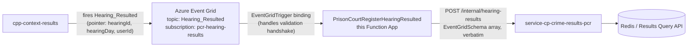
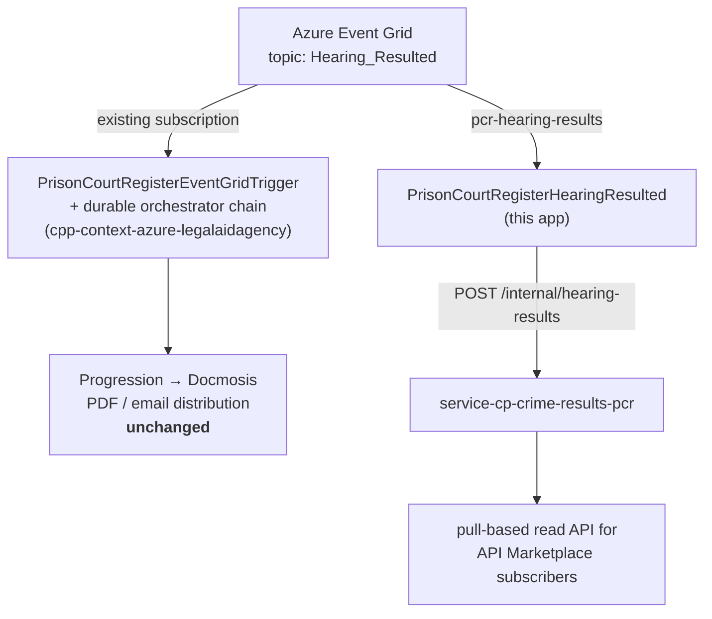

# Plan — thin Event Grid relay Function App for PCR ingestion

**Status:** Implemented, unreviewed. Repo initialised, all files staged, **no commit, no remote, not deployed.**
**Date:** 4 Aug 2026
**Repo:** `/Users/samirgarg/development/moj/code/amp/pcr-eventgrid-relay-function`
**Build:** Gradle 9.6.1, Java 25 toolchain. Coordinates `uk.gov.hmcts.cp:pcr-eventgrid-relay-function`
(version from `-DARTEFACT_VERSION`, default `0.0.999`) — all matching `service-cp-crime-results-pcr`.
**Related:** `service-cp-crime-results-pcr` ADR-007 / AMP-892 and
[`2026-07-29-pcr-eventgrid-webhook-ingestion-design.md`](../../../../service-cp-crime-results-pcr/docs/designs/2026-07-29-pcr-eventgrid-webhook-ingestion-design.md)

> This is a **follow-on to** AMP-892, not a delivery of it. AMP-892 moved PCR ingestion from a
> Service Bus queue to a direct Event Grid webhook on the service. This work keeps Event Grid as the
> transport but puts a thin Function App in front of the service, so the service no longer owns the
> webhook surface. It partially reverses ADR-007's "direct" decision — see §7.

---

## 1. Problem

ADR-007 has Azure Event Grid delivering `Hearing_Resulted` **straight to a webhook** on
`service-cp-crime-results-pcr`. That pulls an Event Grid-shaped surface into a business service:

- a public-ish HTTPS endpoint the service owns and secures,
- the `Microsoft.EventGrid.SubscriptionValidationEvent` handshake, hand-implemented in
  `HearingResultedWebhookService`,
- network isolation standing in for application auth (`security: []` on the operation).

**Correction, 4 Aug 2026.** An earlier revision of this document stated that the legacy JavaScript
durable-functions app (`prisoncourtregister-azure-functions` in `cpp-context-azure-legalaidagency`)
was being retired and replaced by this work. **That was wrong** and has been corrected throughout.
The PCR API-marketplace design is explicit — §13 non-goals: *"Changing or retiring existing email/post
PCR distribution — additional channel, not a replacement"* — and §4a notes the legacy Function App
already listens to the same `Hearing_Resulted` event on its own subscription. The legacy chain keeps
running; see §2a.

## 2. Approach

Insert a thin Java Azure Function app between Event Grid and the PCR service. The
`@EventGridTrigger` binding answers the subscription-validation handshake itself, so **no handshake
code exists in either codebase**, and the PCR service is left receiving an ordinary internal HTTP
call.



No durable task hub, no Redis, no orchestration state in this app — it holds no state at all.

## 2a. Coexistence with the legacy pipeline — this replaces nothing

Both pipelines consume the same topic via **separate** Event Grid subscriptions:



| | Legacy JS durable chain | This relay + PCR service |
|---|---|---|
| Status | **Stays running.** Not retired by this work | New, additional |
| Output | PDF / email distribution | Pull-based read API |
| Register logic | Keeps its own copy | Reimplemented in the PCR service (design §5) |
| Redis | Reads the `INT_<hearingId>_<hearingDay>_result_` key | Same key, read by the PCR service |

Two consequences that must survive into any future change:

1. **The legacy app is a live dependency, not dead weight.** Design §4d: both the Event Grid
   subscription *and* the Redis cache the PCR service reads may be provisioned as part of the legacy
   Function App's own Azure resources — "if the Function App is retired, this service's trigger *and*
   its primary data lookup could both disappear at once". Resolve that before assuming it can be
   switched off.
2. **Two copies of the register logic now exist** and need keeping in step: the legacy generator for
   the PDF path, and the PCR service's ported version for the API path.

## 3. Decisions taken

| # | Decision | Rationale |
|---|---|---|
| 1 | **New standalone repo**, not a module in `cpp-context-azure-legalaidagency` or `cp-ai-rag-service` | legalaidagency is a JS repo under `service-parent-pom`; cp-ai-rag-service is the wrong domain. Standalone gives free choice of Java 25 and a clean parent |
| 2 | **Thin passthrough** — no client-side filtering or enrichment | Register-building logic belongs to the PCR service. No Redis or hearing lookup here |
| 3 | **Java 25**, flagging the CI gap rather than downgrading | Java 25 is GA on the Functions runtime (EOL May 2029). The gap is build-agent only |
| 4 | **Relay the envelope verbatim**, wrapped in a single-element array | Matches the endpoint's existing `requestBody` (array of EventGridSchema), so the PCR service needs **no new contract**. This app sends exactly the request Event Grid would have made |
| 5 | Envelope carried as `JsonNode`, not a typed record | A DTO would silently drop `topic`, `dataVersion`, `metadataVersion` and anything the publisher adds later. Passthrough fidelity is the point |
| 6 | **No mocking framework** — JUnit 5 + AssertJ, real `HttpServer` | One fewer Java-version-compatibility risk on a bleeding-edge JDK; also tests real HTTP status handling rather than stubs |
| 7 | `azure-functions-java-library` kept out of the staged `lib/` | The Java worker supplies it; a second copy risks binding-resolution errors. Corrects a latent issue in the `ai-document-answer-scoring-function` template this was patterned on. Mechanism changed with the Gradle move — see 9 |
| 8 | **Gradle, not Maven** — matching `service-cp-crime-results-pcr` | Same wrapper (9.6.1), same Java 25 toolchain, same `gradle/*.gradle` convention-script split, same `.github/pmd-ruleset.xml`, same `ARTEFACT_VERSION`/`uk.gov.hmcts.cp` coordinates. Uses Microsoft's official `com.microsoft.azure.azurefunctions` plugin 1.17.0, the Gradle counterpart of `azure-functions-maven-plugin`. Removed: `pom.xml`, `src/main/assembly/zip.xml` |
| 9 | `implementation` + an explicit **`pruneWorkerProvidedJars`** task, replacing Maven's `provided` scope | Two Gradle-specific findings, both verified rather than assumed: (a) `azureFunctionsPackage` scans the *runtime* classpath for `@FunctionName`, so `compileOnly` fails with `ClassNotFoundException`; (b) the plugin does **not** exclude that library from `lib/` by itself. So it must be a runtime dependency and then pruned post-packaging. `lib/` ends up identical to the Maven build's 7 jars |
| 10 | **CI on GitHub Actions**, not Azure DevOps; `azure-pipelines.yaml` deleted | Follows `service-cp-crime-results-pcr`. Resolves two blockers at once: the shared `context-verify` template drives Maven (this repo is Gradle), and the CPP pool identifiers are Java 21. `actions/setup-java@v5` installs Java 25 with no bespoke agent image. Downstream jobs diverge from PCR because this ships a Functions zip, not a container — no publish/Docker/ACR/AKS, no `composeUp`, no DAST (nothing exposes HTTP to scan); `Azure/functions-action` replaces the Helm deploy |
| 11 | CI **verifies the packaged zip**, not just the build | Three failure modes are invisible until runtime in Azure: a missing `eventGridTrigger` binding, a `function.json` `scriptFile` not matching the versioned jar in the zip (a live risk because CI injects `ARTEFACT_VERSION`), and `azure-functions-java-library` shipped in `lib/` if decision 9's prune silently breaks. The step asserts all three |
| 12 | **Integration tests run the real Functions host**, not a mocked binding | The Event Grid trigger is an HTTP webhook (`/runtime/webhooks/eventgrid`), so the real host can be driven exactly as Event Grid does with no Azure resources. The only way to test what we do not own — host, extension, binding — and it **verified the handshake claim** that justifies this app's existence |
| 13 | Integration tests **placed** exactly as `service-cp-crime-results-pcr` places them | First attempt used a separate `integrationTest` source set + Testcontainers. Corrected: tests live in `src/test` under an `integration` package, named `*IntegrationTest`, with infra helpers in `integration/config` (counterparts of PCR's `PostgresInitialise`/`RedisInitialise`) and an `IntegrationTestBase`; containers come from **docker-compose** via `com.avast.gradle.docker-compose`. Side benefit — dropping Testcontainers removed the docker-java/Docker-29 API-version workaround entirely |
| 14 | …but **execution is split** into `test` (unit, no Docker) and `integrationTest` (`include '**/integration/**'`, same source set) | PCR runs everything in one `test` task, which made `./gradlew test` require Docker and take ~30s. Splitting keeps the fast feedback loop Docker-free while `build` still runs both via `check`. `dockerCompose.isRequiredBy(integrationTest)` handles up/down including on failure, so CI is a single `./gradlew build` with no sequencing to get wrong, and the test code needs no "is the stack up?" branch. This is the one conscious divergence from PCR's pattern |

### Course-correction during implementation

The first cut POSTed a flattened `{hearingId, hearingDate, cjscppuid}` body, mirroring what the
legacy JS trigger passed into its orchestrator. Reading the PCR service's accepted design showed the
real target is `POST /internal/hearing-results` taking an **EventGridSchema JSON array** with
`security: []`. Reworked to decision 4 above; the flattened models were deleted.

## 4. What was built

Code patterned on `ai-document-answer-scoring-function` in `cp-ai-rag-service` (no-arg production
constructor reading env vars + package-private constructor for tests; SLF4J over log4j2).
**Build patterned on `service-cp-crime-results-pcr`** — Gradle, not Maven (decision 8).

```
src/main/java/uk/gov/moj/cpp/prisoncourtregister/
├── PrisonCourtRegisterHearingResultedFunction.java   @FunctionName + @EventGridTrigger
├── SystemVariables.java                              env-var name constants
├── model/     ForwardableEvent (hearingId + raw JsonNode envelope)
├── service/   EventForwarder, HttpEventForwarder, ForwardingException, EventParsingException
└── util/      EnvVarUtil, ObjectMapperFactory
```

Repo-level: `build.gradle`, `settings.gradle`, `gradlew` + `gradle/wrapper/` (9.6.1),
`gradle/{java,repositories,test,pmd}.gradle`, `host.json`, `Azure/local.settings.sample.json`,
`README.md`, `CLAUDE.md`, `CODEOWNERS`, `LICENSE` (MIT), `.gitignore`.

CI (`.github/`): `dependabot.yml`, `pmd-ruleset.xml`, and `workflows/` —
`ci-build-deploy.yml` (reusable), `ci-draft.yml`, `ci-released.yml`, `code-analysis.yml`,
`codeql.yml`, `secrets-scanner.yml`, `auto-merge-dependabot.yml`.

### Error-handling contract

Mirrors the PCR endpoint's documented semantics. Each line is load-bearing:

| Situation | Behaviour |
|---|---|
| `200` | Done |
| `503` — service's "hearing details not complete yet" | **Retried** up to `FORWARD_MAX_ATTEMPTS`, then propagated so Event Grid redelivers |
| `400` — malformed / unrecognised `eventType` | Fails immediately; the contract calls it permanent, so retrying only wastes budget |
| Other 5xx, `429`, `408`, I/O | Retried, then propagated |
| Missing/blank `data.hearingId` | Logged WARN, **returns normally**. Matches the legacy trigger, which started no orchestration. Also covers a validation event reaching the handler |
| Malformed JSON | `EventParsingException` propagates → dead-letters. Not swallowed, so loss is visible |

In-process retries sit **under** Event Grid's own retry policy (exponential backoff, up to 24h), so
total attempts multiply. Keep `FORWARD_MAX_ATTEMPTS × FORWARD_RETRY_DELAY_IN_SECONDS` well below the
Function App timeout.

### Configuration

Only `PCR_SERVICE_INGESTION_ENDPOINT` is required. Also
`PCR_SERVICE_INGRESS_HEADER_NAME`/`_VALUE` (optional, both must be set to apply — the endpoint is
`security: []` so normally unset), `FORWARD_MAX_ATTEMPTS` (3),
`FORWARD_RETRY_DELAY_IN_SECONDS` (2), `HTTP_CLIENT_CONNECT_TIMEOUT_IN_SECONDS` (10),
`HTTP_CLIENT_RESPONSE_TIMEOUT_IN_SECONDS` (30). Full table in README.md.

## 5. Verification performed

| Check | Result |
|---|---|
| `./gradlew clean build pmdMain azureFunctionsPackageZip` | **BUILD SUCCESSFUL**, 23 tests, 0 failures, 0 PMD violations |
| Bytecode target | major version **69** = Java 25, on Temurin 25.0.2 |
| Compiler strictness | passes `-Xlint:unchecked -Werror` |
| Generated `function.json` | Correct `eventGridTrigger` binding, `direction: in`, `name: event` |
| Deployable artefact | `build/azure-functions/fa-ste-ccp0121-pcrrelay.zip` — contains `function.json`, `host.json`, app jar, `lib/` |
| `lib/` contents | 7 runtime jars; `azure-functions-java-library` absent (pruned — see decision 9) |
| Relayed body | Asserted byte-equal to the input envelope inside a 1-element array, against a real `HttpServer` |
| Config drift | Every `SystemVariables` constant present in `local.settings.sample.json` |
| Gradle wrapper tracked | `gradle-wrapper.jar` not swallowed by the `*.jar` ignore rule |
| `./gradlew build` from clean | **BUILD SUCCESSFUL**, **29 tests** (23 unit + 6 integration), 0 failures, 0 skipped — the whole CI command |
| `./gradlew test` | 23 unit tests in ~6s, **no Docker**, no containers started |
| `./gradlew integrationTest` | 6 tests, brings the stack up and down itself (~28s) |
| Teardown on failure | A failing `integrationTest` still runs `composeDown`; 0 containers left behind |
| **Event Grid handshake** | **Verified** — real host answers `SubscriptionValidation` with `200 {"validationResponse": …}`, event never reaches PCR |
| Packaged artefact loads | Asserted in the real host: an unknown `functionName` would 404, so a 2xx proves the app registered |
| PMD task wiring | All `pmd*` tasks stay out of `check`; `pmdMain` still runs on request |

Not done: no deployment, and no test against a **real** Azure Event Grid subscription or a live PCR
service — see open items 1 and 2a. CI has not run yet (no remote).

## 5a. Verified in STE — 7 Aug 2026

Deployed to `fa-ste-ccp0121-pcrrelay` and exercised with a synthetic event posted to
`/runtime/webhooks/eventgrid`.

| Hop | Result |
|---|---|
| App loads on Java 25, function registered | ✅ |
| Topic → `egs-pcr-relay` → function | ✅ (verified by publishing to the topic) |
| Parse, `hearingId` extraction | ✅ |
| **TLS to the PCR ingress** | ✅ — VNet integration + CA bundle + `PCR_SERVICE_CA_BUNDLE_PATH` |
| Retry / backoff / propagate | ✅ 3 attempts, then 500 so Event Grid redelivers |
| PCR returns success | ❌ answers **500** |

Three separate causes had to be fixed to get TLS working, and the first two looked identical in the
logs (`I/O failure … : null`):

1. **No VNet integration** — the app could not route to the internal ingress. The siblings are attached
   to `sn-ste-ccp0121-courtreg`; ours was not.
2. **No private-CA trust** — the ingress certificate is issued by a CA no JVM ships. Fixed by
   `AdditiveTrust` plus shipping the bundle in the package.
3. **`PCR_SERVICE_CA_BUNDLE_PATH` unset** — the trust code was inert without it, and `config-zip` does
   not apply the `azurefunctions` appSettings block, so it had to be set explicitly.

**Deploy mechanism correction.** `config-zip` cannot deploy this app: `azureFunctionsDeploy` sets
`WEBSITE_RUN_FROM_PACKAGE` to a blob SAS URL, and once it holds a URL Kudu ZipDeploy 409s permanently.
The app therefore diverges from its seven siblings, which use `WEBSITE_RUN_FROM_PACKAGE=1`.

The remaining 500 is the PCR service's. Notably it is not the `503` its contract documents for
"hearing details not complete yet", so it is erroring on an unknown hearing rather than taking its
documented not-ready path — a question for that service, not this relay.

## 6. Open items

| # | Item | Owner | Blocking? |
|---|---|---|---|
| 1 | ~~**`eventType` filtering.**~~ **Resolved 5 Aug 2026 by inspecting the live topic.** `eg-ste-ccp0121-hearingres` already separates types across subscriptions: `egs-prison-court` / `egs-court-register` / `egs-laa` etc. are `includedEventTypes=[Hearing_Resulted]`, while `Hearing_Resulted_Complex` goes to `egs-nowsce-complex` (StorageQueue) and `SJP_Hearing_Resulted` to its own. So `egs-pcr-relay` just needs `--included-event-types Hearing_Resulted`, and no client-side filtering is warranted | — | Done |
| 2 | ~~**CI cannot build this repo.**~~ **Resolved 4 Aug 2026** — moved to **GitHub Actions** (decision 10), matching `service-cp-crime-results-pcr`. `azure-pipelines.yaml` deleted. Java 25 comes from `actions/setup-java@v5`, so the Java-21-agent problem and the Maven-template problem both disappear | — | Done |
| 2a | **Deploy credentials not provisioned.** The `Deploy` job needs an Entra app registration with a federated credential for this repo, Contributor (or Website Contributor) on the Function App, and `AZURE_CLIENT_ID` / `AZURE_TENANT_ID` / `AZURE_SUBSCRIPTION_ID`. It **skips with a warning** until then, so PRs stay green and nothing falsely reports a deploy. Alternative if deployment must stay in ADO: replace the job with `hmcts/trigger-ado-pipeline` against a Functions-capable pipeline | Platform | **Yes**, for deploy |
| 3 | ~~**Deploy stage undefined.**~~ **Resolved 4 Aug 2026** — the GitHub Actions `Deploy` job uses `Azure/functions-action` against the packaged zip (decision 10). Only the credentials remain outstanding, tracked as 2a | — | Done |
| 4 | ~~**Azure coordinates are placeholders.**~~ **Resolved 5 Aug 2026 against the live subscription.** Now `fa-ste-ccp0121-pcrrelay` in `RG-STE-CCP0121-HEARINGRES` on the existing shared plan `as-ste-ccp0121-hearingres` (EP3 ElasticPremium, Linux — verified `reserved: true`, so Java 25 linux is compatible and no new plan is needed). Storage `sasteccp0121hearingres`, App Insights `ai-ste-ccp0121-hearingres`. **The app itself still does not exist and must be created** — see 4a | — | Done |
| 4a | **Function App not created.** Every app in the group is Node; this would be the first Java one. 30+ identically-shaped `*-HEARINGRES` groups imply central automation and no IaC was found, so prefer platform-team provisioning over a hand-run `az functionapp create`. Deploy rights also unconfirmed: `az functionapp show` on a sibling fails `AuthorizationFailed` on `Microsoft.Web/sites/publishxml/action` | Platform | **Yes**, for deploy |
| 4b | ~~**`PCR_SERVICE_INGESTION_ENDPOINT` unknown.**~~ **Resolved 5 Aug 2026:** `https://<pcr-service-ingress-host>/pcr/internal/hearing-results` (host confirmed by this team — `devamp01` is the AMP stack in the PCR service's `Deploy-Dev` job; my earlier guess of `steccm64` was the *CP backend* the sibling function apps call, a different thing). Ingress prefix `/pcr` + service path `/internal/hearing-results` | — | Done |
| 4c | **The endpoint path in ADR-007 is not what shipped.** The design doc specifies `POST /internal/pcr/hearingResults`; the artefact the service actually builds against (`api-cp-crime-results-pcr:1.1.2`) declares `POST /internal/hearing-results` (`operationId=receiveHearingResultedWebhook`). This repo had the doc's path throughout — in the sample config, the compose stack, the WireMock stub and the Javadoc — and has been corrected to the built spec. Worth fixing in the PCR design doc too | This team | Done here; doc fix outstanding |
| 5 | **There is nothing to repoint — ADR-007's premise is wrong.** That design says the `pcr-hearing-results` subscription is "already provisioned, confirmed by the platform team". It is **not** on `eg-ste-ccp0121-hearingres`: 13 subscriptions exist and none is it, so nothing currently delivers to the PCR service's webhook. `egs-pcr-relay` would be the first delivery path, which makes `HearingResultedWebhookController` / `HearingResultedWebhookService` dead code rather than something to migrate off. Worth correcting in the PCR repo. The legacy chain's own subscription is untouched either way (§2a) | This team + platform | No |
| 6 | ~~**Repo name.**~~ **Resolved 4 Aug 2026** — renamed from `cpp-context-azure-prisoncourtregister` to `pcr-eventgrid-relay-function`; `artifactId` → `pcr-eventgrid-relay-function`, and with the Gradle move (decision 8) `group` → `uk.gov.hmcts.cp` to match the PCR service. The Java package stays `uk.gov.moj.cpp.prisoncourtregister` — PCR *is* Prison Court Register, so it remains accurate, and `@FunctionName` is a deployed identity not worth churning | — | Done |
| 7 | **No GitHub remote / no commit.** Needs an initial commit and an `hmcts/pcr-eventgrid-relay-function` repo. Note CI is GitHub Actions now, so there is no SonarQube project to register — `code-analysis.yml` runs PMD and `codeql.yml` runs CodeQL instead | This team | No |
| 7a | **Fetch the CA bundle from infrastructure in CI, and stop committing it.** The PCR internal ingress uses a private CA no JVM ships; the bundle is currently committed, which is why the repo was made private. Target: CI authenticates with the same Entra federated credential the `Deploy` job needs, pulls the bundle from Key Vault, and drops it in before `azureFunctionsPackageZip`. The build and CI plumbing is now **done**: `CA_BUNDLE_SOURCE` selects the source, the `Materialise the internal CA bundle` CI step writes the `PCR_INTERNAL_CA_BUNDLE` secret to `RUNNER_TEMP` and exports it, and a set-but-unusable path fails the build instead of falling back. Remaining: set the secret, delete the committed copy. Swapping the GitHub secret for Key Vault changes only that one step. Buys: repo can go public again, CA rotation becomes an infra change not a code commit, no certificate material in git history. Needs a source of truth (Key Vault secret vs GitHub secret — platform team's call) and `get` access for CI. See README "Internal CA trust" | Platform + this team | No, but it unblocks going public |
| 8 | **ADR needed.** This partially reverses ADR-007's direct-webhook decision; worth its own ADR in the PCR repo so the reasoning is not only in this repo's README | This team | No |

## 7. Trade-off: does this undo ADR-007?

Partly, and deliberately. ADR-007 rejected an intermediary because the only options considered were
Service Bus (a queue to provision and own) versus a direct webhook. A Function App is a third shape
it did not weigh:

| | Direct webhook (ADR-007) | Function App relay (this) |
|---|---|---|
| Validation handshake | Hand-written in the PCR service | Free — the binding does it |
| Endpoint exposure | Service owns a public-ish HTTPS path | Service receives an internal call only |
| Event Grid coupling | In the business service | Isolated in a 6-class app |
| Retry / dead-letter | Event Grid policy | Event Grid policy, plus in-process retry for `503` |
| New moving part | None | One Function App to deploy and monitor |
| PCR contract change | — | **None** — relays verbatim |

The cost is one more deployable. The gain is that a business service stops owning transport
concerns. Note item 1: this app forwards `eventType` untouched, so it does not paper over the
enum mismatch — that must be fixed at the subscription.

## 8. Incidental finding (unrelated to this work)

`cpp-context-azure-legalaidagency/azure-functions/durable-functions/local.settings.json` is
**git-tracked** and contains what appear to be live storage-account keys and a Redis key. Worth
rotating and untracking independently.
